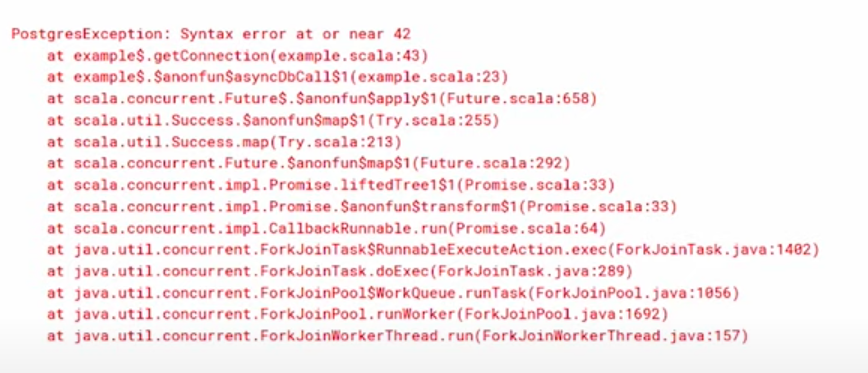

slidenumbers: true
footer:  
slidenumber-style: alignment(right)
footer-style: alignment(left)

[.hide-footer]
[.slidenumbers: false]
[.text: alignment(right)]


A presentation with memes

---

[.column]

# [fit] What is
# [fit] *ZIO*?

[.column]


---

## [fit] *ZIO* is
## [fit] a *functional library* for
## [fit] *asynchronous* and
## [fit] *concurrent* programming

### [fit] Created by _*John De Goes*_

---

# [fit] What is wrong
# [fit] with *Future[_]* ?

---

## [fit] *Future* cannot wrap side effects.


---

For example, the following code

```scala
val myFuture = for {
   _ <- Future{println("Hello")}
   _ <- Future{println("Hello")}
} yield ()
```

cannot be refactored into

```scala
lazy val myEffect = Future{println("Hello")}

val myFuture = for {
   _ <- myEffect
   _ <- myEffect
} yield ()
```

(`Hello` is only displayed *once* on the screen.)

---

## [fit] Always needs to have an *ExecutionContext*


---

### [fit] And this implicit is **EVERYWHERE!**

Most methods of *Future* use this and very often we end up writing a lot of boilerplate just for that.

```scala
def map[S](f (T) => S)(implicit executor: ExecutionContext): Future[S]

def foreach[U](f (T) => U)(implicit executor: ExecutionContext): Unit
```

---

## [fit] *Future* is un-interruptable


---

```scala
val future: Future[Response] = ???
val executed: Response = Await.result(future, 60.seconds)
```

Let's imagine that your *Future* is writing to a database.
If it takes longer than _60 seconds_, the process will keep on running in the background, potentially **consuming resources.**

---

## [fit] *Future* is hard to troubleshoot


---



We see a lot from the implementation from *Future* not so much about our code 😩

---

# [fit] The details

---

## [fit] One effect type, multiple aliases


---

### [fit] The whole library is
### [fit] based around one datatype:
### [fit] [the *ZIO* class](https://zio.dev/docs/overview/overview_index#zio).

A *ZIO* object is the description of a *process*.

It can be an **atomic action** (initialize a variable for example) or composed of **multiple sub-processes** ("Read from input", "Process the data", "Write to output" can all be wrapped into "ETL process" for example).

---

```scala
ZIO[R, E, A]
```

Where:

- *R* is the *Environment Type*

- *E* is the *Failure Type*

- *A* is the *Success Type*

This can be summarized by:

```scala
R => Either[E, A]
```

---

When you think about it, a *Future[A]* can be represented as the following type

```scala
ZIO[ExecutionContext, Throwable, A]
```

We need an *ExecutionContext* to run it and it returns either a value of type *A* if everything went fine or a *Throwable* if there was an Exception.

---

### There are multiple aliases

```scala
type UIO[A] = ZIO[Any, Nothing, A]

type Task[A] = ZIO[Any, Throwable, A]

type RIO[R, A] = ZIO[R, Throwable, A]

type IO[E, A] = ZIO[Any, E, A]
```

[And many others!](https://zio.dev/docs/overview/overview_index#type-aliases)

---

# [fit] Using ZIO


---

## [fit] Basic operations

```scala
import zio._

// You can map
val answerToLife: UIO[Int] = IO.succeed(21).map(_ * 2)

// You can use your Future
val myFuture: Future[A] = ???
val myZioFuture: IO[Throwable, A] = ZIO.fromFuture(myFuture)

// You can chain your calls together
val consoleDependentChain = getStrLn
    .flatMap(input => putStrnLn(s"Read $input from line"))

```
---

## [fit] Basic operations

*For-comprehension* makes our functional code look more "procedural"

```scala
import zio._

val program =
   for {
       _    <- putStrLn("Hello! What is your name?")
       name <- getStrLn
       _    <- putStrLn("Nice to meet you, $name !")
   } yield ()

```

---

[.column]
# [fit] Having fun with
# [fit] *fibers*

[.column]


---

## [fit] What are *fibers*?

> [...] *Fibers* are a lightweight mechanism for concurrency.

> You can fork any IO[E, A] to immediately yield an UIO[Fiber[E, A]].

-- [Official documentation](https://zio.dev/docs/datatypes/datatypes_fiber)

---

From the documentation:

```scala
import zio._

val analyzed =
  for {
    fiber1   <- analyzeData(data).fork  // IO[E, Analysis]
    fiber2   <- validateData(data).fork // IO[E, Boolean]
    // Do other stuff
    valid    <- fiber2.join
    _        <- if (!valid) fiber1.interrupt
                else IO.unit
    analyzed <- fiber1.join
  } yield analyzed

```

---

# [fit] Quick demo


---

# [fit] To go further

## Website

- [The official website](https://zio.dev/)

## Youtube videos

- [John De Goes - Upgrade Your Future](https://www.youtube.com/watch?v=USgfku1h7Hw)

- [Fabio Labella—How do Fibers Work? A Peek Under the Hood](https://www.youtube.com/watch?v=x5_MmZVLiSM)

--- 

# [fit] To go further (continued)

## Online chats

- The official [Discord channel](https://discord.com/invite/2ccFBr4)
- The official [Gitter channel](https://gitter.im/ZIO/Core)

## Trainings for the general public

- [John De Goes's Patreon page](https://www.patreon.com/jdegoes) - The *Monad* and *Spartan* tiers are worth the price!